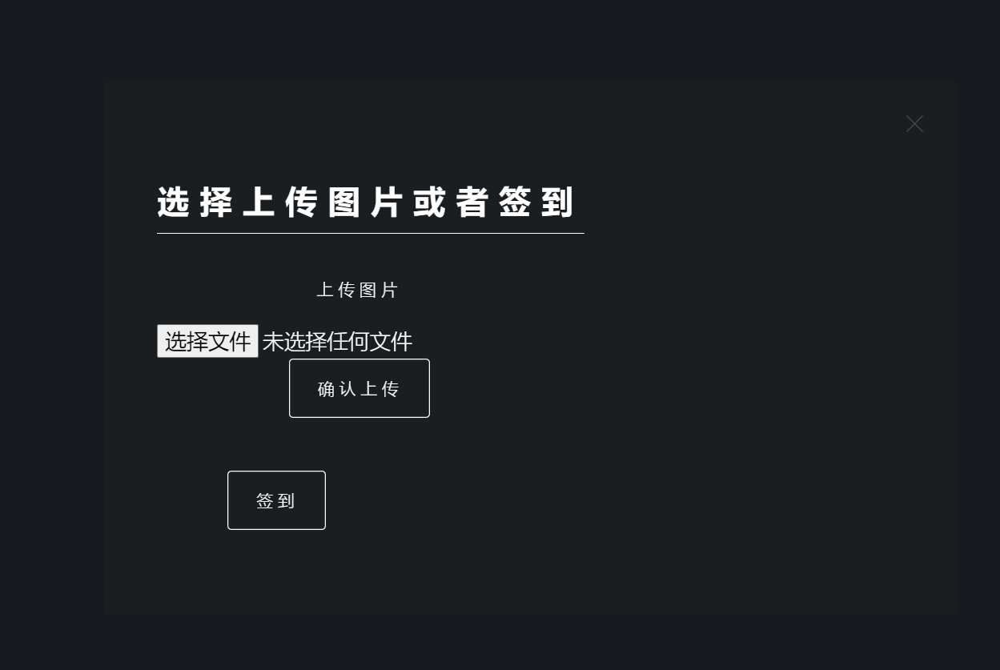

# InfoCheck

一个简易的身份证签到系统

## 1. 使用方法

在Web文件下：`python websteaming.py`

1. 上传自己的身份证图片：选择文件→确认上传

)

2. 点击签到：打开摄像头，若检测到结果则会出现“查看结果”按钮，点击即可查看结果


## 2. 数据库的使用


```python
ID: 身份证卡号
name: 姓名
sex: 男/女
nation: 民族
birth: 生日(如：1984年10月1日)
cardImg: 图片保存为二进制流格式
cardImgHeight: 图片高（用来恢复图像）
cardImgWidth: 图片宽

the example of insert data:
==> sqText = "insert into user(ID, name, sex, nation, birth, address, cardImg, cardImgHeight, cardImgWidth) values(?, ?, ?, ?, ?, ?, ?, ?, ?);"
==> cursor.execute(sqText, ('111111111111111111', '张三', '男', '汉族', '1984年10月1日', '重庆市xxx', img_blob, img.shape[0], img.shape[1]))
```


## 3. 原理

### 3.1 图像分割


### 3.2 OCR


### 3.3 人脸检测


